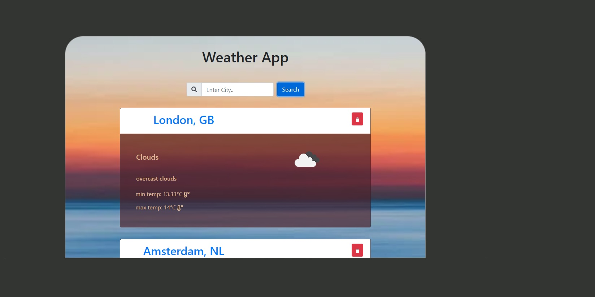

# Weather App as a Single Page Application

using https://api.openweathermap.org/ API to fetch city weather!

## The SPA with 2 pages (routes):

- Home page: you can type the city in the search box to fetch it's weather, and
  you can see the already fetched city.

- Individual city weather info with the chart for the 5 days forcast.

### Demo

Online Deployment of this project is available at
https://pedantic-lamport-6687b4.netlify.app/

## Getting Started with Create React App

This project was bootstrapped with
[Create React App](https://github.com/facebook/create-react-app).

## Available Scripts

In the project directory, you can run:

### `npm start`

Runs the app in the development mode.\
Open [http://localhost:3000](http://localhost:3000) to view it in the browser.

The page will reload if you make edits.\
You will also see any lint errors in the console.

#### Libraries/Frameworks

- react: UI library
- react-router-dom: The router components of react
- react-icons
- react-dom:
- fortawesome/fontawesome-free
- recharts : npm package with varity of charts.
